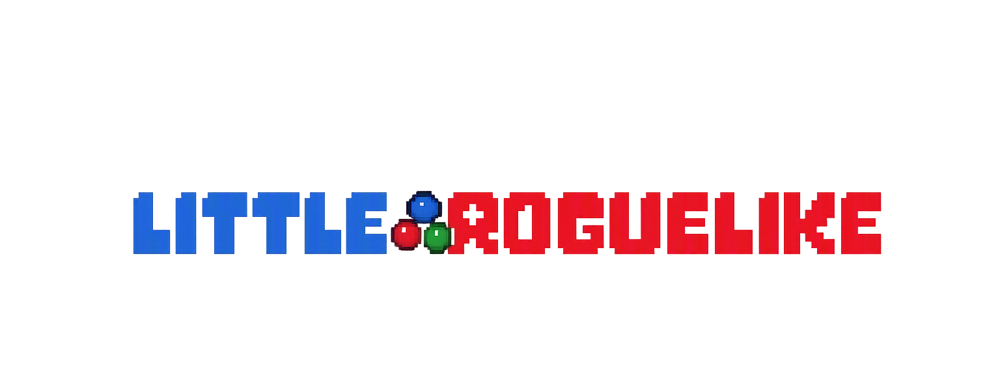

  

<h1 align="center">Little Roguelike</h1>

  Um roguelike desenvolvido em C e lua enquanto eu e meu irmao aprendemos programação (sim a logo é inspirada em undertale).

---

# Roguelike em C e Lua

> Um roguelike desenvolvido em C e lua com o objetivo de aprender programação e construir um projeto do zero.

## Sobre

Esse projeto está sendo desenvolvido enquanto aprendo a linguagem C e meu irmao Lua.

O objetivo não é apenas criar um jogo divertido, mas também entender conceitos importantes como:
- os fundamentos de ambas linguagens
- o uso do git e github
- raylib

Conforme eu aprender coisas novas, partes do código serão melhoradas ou reescritas.

---

## Funcionalidades

- [ ] Criação do personagem
- [ ] Sistema de atributos
- [ ] Combate
- [ ] Inventário
- [ ] NPCs
- [ ] Salas aleatórias
- [ ] Itens e equipamentos
- [ ] Sistema de níveis
- [ ] Save/Load

---

## Objetivos

- Aprender C e Lua na prática.
- Escrever código cada vez mais organizado.
- Evoluir o projeto conforme ganhamos experiência.
## poder mostar para as pessoas o quão interessante e divertido pode ser a programação
---

## Tecnologias
- linguagem Lua
- Linguagem C
- GCC
- Git
- GitHub

---

## Progresso

O projeto ainda está em desenvolvimento.

Cada commit representa um passo na minha evolução um amante da programação.

---

## Licença

Este projeto é apenas para fins de estudo.
